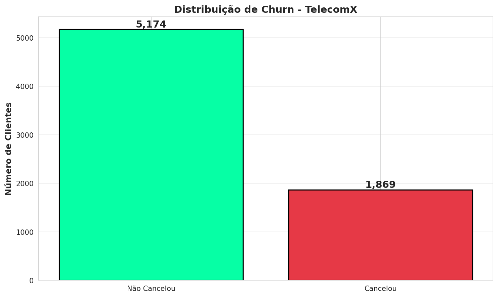
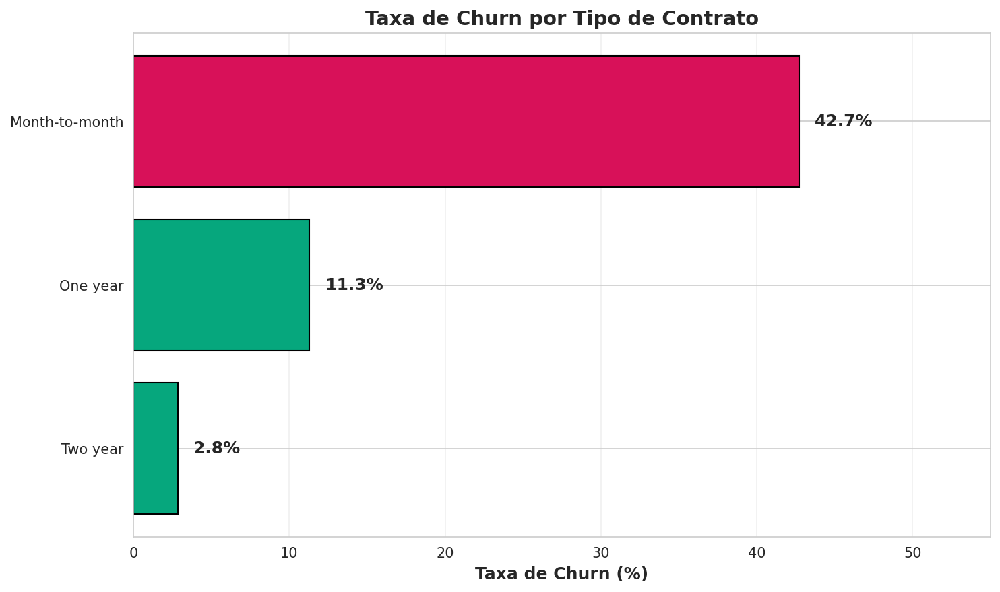
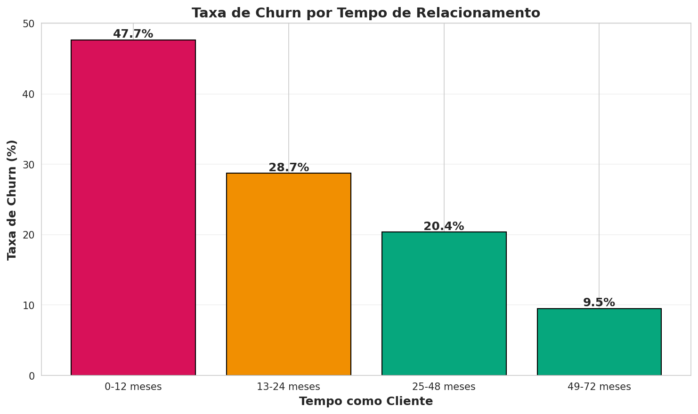

# 📊 TelecomX - Análise de Evasão de Clientes (Churn)

[](https://www.python.org/)
[](https://pandas.pydata.org/)
[](https://jupyter.org/)
[](LICENSE)
[]()

> **Análise completa de churn** da TelecomX utilizando processo **ETL + EDA**, com dataset preparado para **Machine Learning**.

---

## 📑 Sumário

- [Sobre o Projeto](#-sobre-o-projeto)
- [Diferencial: Preparação para ML](#-diferencial-preparação-para-machine-learning)
- [Principais Resultados](#-principais-resultados)
- [Visualizações](#-visualizações)
- [Estrutura do Repositório](#-estrutura-do-repositório)
- [Tecnologias Utilizadas](#-tecnologias-utilizadas)
- [Como Executar](#-como-executar)
- [Dataset](#-dataset)
- [Metodologia](#-metodologia)
- [Insights e Recomendações](#-insights-e-recomendações)
- [Declaração de Uso de IA](#-declaração-de-uso-de-ia)
- [Autor](#-autor)
- [Licença](#-licença)

---

## 🎯 Sobre o Projeto

Este projeto foi desenvolvido como parte do **Challenge Data Science** da [Alura](https://www.alura.com.br/) em parceria com o programa [Oracle Next Education (ONE)](https://www.oracle.com/br/education/oracle-next-education/).

### O Problema

A **TelecomX** é uma empresa de telecomunicações que enfrenta um desafio crítico: **alto índice de cancelamento de contratos (churn)**. Compreender os fatores que levam à evasão é essencial para desenvolver estratégias de retenção eficazes.

### Objetivos do Challenge

1. **Extrair** dados de clientes via API REST
2. **Transformar** e limpar dados para análise
3. **Identificar padrões** que diferenciam clientes que cancelam vs. permanecem
4. **Gerar insights acionáveis** para retenção

---

## 🚀 Diferencial: Preparação para Machine Learning

> **Nota:** A preparação do dataset para Machine Learning foi uma **decisão proativa do autor**, indo além do escopo original do Challenge.

### Por que essa decisão?

Após concluir a análise exploratória, identifiquei que o próximo passo natural em um projeto real de Data Science seria a construção de um modelo preditivo. Por isso, optei por deixar o dataset **pronto para modelagem**, mesmo não sendo um requisito do Challenge.

### Fundamentação Técnica

Esta abordagem segue o framework **CRISP-DM** (Cross-Industry Standard Process for Data Mining), reconhecido como o modelo de analytics mais utilizado na indústria segundo a [Wikipedia](https://en.wikipedia.org/wiki/Cross-industry_standard_process_for_data_mining):

```
┌─────────────────────────────────────────────────────────────────┐
│                        CRISP-DM                                 │
├─────────────────────────────────────────────────────────────────┤
│  1. Business Understanding    ✅ Concluído                      │
│  2. Data Understanding        ✅ Concluído (EDA)                │
│  3. Data Preparation          ✅ Concluído (ETL)                │
│  4. Modeling                  🔜 Dataset preparado para esta   │
│  5. Evaluation                    etapa                         │
│  6. Deployment                                                  │
└─────────────────────────────────────────────────────────────────┘
```

Segundo o [Business Analytics Institute](https://businessanalyticsinstitute.com/understanding-the-crisp-dm-methodology-for-data-science-projects/):

> *"The Modeling phase is where analysts apply various statistical and machine learning techniques to build predictive models based on the prepared dataset."*

### O que foi preparado para ML

| Preparação | Descrição | Benefício para ML |
|------------|-----------|-------------------|
| **Tipos corretos** | Todas as colunas com dtype apropriado | Evita erros de processamento |
| **Sem valores nulos** | Missing values tratados | Modelos não aceitam NaN |
| **Colunas traduzidas** | Nomes em português padronizados | Facilita interpretação |
| **Variável target clara** | Coluna `cancelou` (Yes/No) | Pronta para classificação |
| **Dataset exportado** | CSV limpo disponível | Importação direta |

### Referências

- [CRISP-DM - Wikipedia](https://en.wikipedia.org/wiki/Cross-industry_standard_process_for_data_mining) - "The most widely-used analytics model"
- [CRISP-DM Methodology - Business Analytics Institute](https://businessanalyticsinstitute.com/understanding-the-crisp-dm-methodology-for-data-science-projects/)
- [Data Science Workflow - IABAC](https://iabac.org/blog/what-is-the-data-science-workflow)
- [CRISP-DM for Data Science - Data Science PM](https://www.datascience-pm.com/crisp-dm-2/)

---

## 📈 Principais Resultados

| Métrica | Valor |
|---------|-------|
| **Taxa de Churn** | 26,54% |
| **Total de Clientes Analisados** | 7.043 |
| **Clientes que Cancelaram** | 1.869 |
| **Perda Anual Estimada** | US$ 2,86 milhões |

### Descobertas-Chave

- 📱 **Contrato mensal** tem taxa de churn de **42%** (vs. 3% em contratos de 2 anos)
- 🌐 **Fibra óptica** apresenta churn de **42%** (vs. 19% em DSL)
- 👤 **Clientes novos** (0-12 meses) têm **48%** de probabilidade de cancelar
- 💳 **Boleto eletrônico** está associado a **45%** de churn

---

## 📊 Visualizações

### Distribuição Geral de Churn

<p align="center">
  
</p>

### Taxa de Churn por Tipo de Contrato

<p align="center">
  
</p>

### Taxa de Churn por Tempo de Relacionamento

<p align="center">
  
</p>

---

## 📁 Estrutura do Repositório

```
telecomx-churn-analysis/
│
├── assets/
│   └── images/                  # Gráficos e visualizações
│       ├── churn_geral.png
│       ├── churn_contrato.png
│       └── churn_tempo.png
│
├── data/
│   └── processed/               # Dados tratados
│       └── telecom_limpo.csv
│
├── docs/                        # Documentação adicional
│   └── Challenge Telecom X - Análise de evasão de clientes.pdf
│
├── notebooks/
│   └── analise_churn_telecom.ipynb    # Notebook principal
│
├── .gitignore                   # Arquivos ignorados pelo Git
├── LICENSE                      # Licença MIT
├── README.md                    # Este arquivo
└── requirements.txt             # Dependências do projeto
```

---

## 🛠️ Tecnologias Utilizadas

| Categoria | Tecnologia | Versão | Uso |
|-----------|------------|--------|-----|
| **Linguagem** | Python | 3.10+ | Base do projeto |
| **Dados** | Pandas | 2.0+ | Manipulação e análise |
| **Dados** | NumPy | 1.24+ | Operações numéricas |
| **Visualização** | Matplotlib | 3.7+ | Gráficos estáticos |
| **Visualização** | Seaborn | 0.12+ | Visualização estatística |
| **Visualização** | Plotly | 5.18 | Gráficos interativos |
| **HTTP** | Requests | 2.28+ | Extração via API |
| **Ambiente** | Jupyter | - | Desenvolvimento interativo |

---

## 🚀 Como Executar

### Pré-requisitos

- Python 3.10 ou superior
- pip (gerenciador de pacotes)

### Instalação

1. **Clone o repositório**
   ```bash
   git clone https://github.com/thedrads/telecomx-churn-analysis.git
   cd telecomx-churn-analysis
   ```

2. **Crie um ambiente virtual** (recomendado)
   ```bash
   python -m venv venv
   source venv/bin/activate  # Linux/Mac
   venv\Scripts\activate     # Windows
   ```

3. **Instale as dependências**
   ```bash
   pip install -r requirements.txt
   ```

4. **Execute o notebook**
   ```bash
   jupyter notebook notebooks/analise_churn_telecom.ipynb
   ```

### Execução no Google Colab

[](https://colab.research.google.com/github/thedrads/telecomx-churn-analysis/blob/main/notebooks/analise_churn_telecom.ipynb)

---

## 📋 Dataset

### Fonte

Dados extraídos via API REST do repositório do Challenge Alura.

### Dimensões

- **Registros:** 7.043 clientes
- **Variáveis:** 21 características

### Dicionário de Dados

| Variável Original | Variável Traduzida | Descrição |
|-------------------|-------------------|-----------|
| customerID | id_cliente | Identificador único |
| gender | genero | Masculino/Feminino |
| SeniorCitizen | idoso | Cliente 65+ anos (0/1) |
| Partner | tem_parceiro | Possui parceiro (Yes/No) |
| Dependents | tem_dependentes | Possui dependentes (Yes/No) |
| tenure | meses_cliente | Tempo como cliente (meses) |
| PhoneService | servico_telefone | Serviço telefônico (Yes/No) |
| MultipleLines | linhas_multiplas | Múltiplas linhas |
| InternetService | tipo_internet | DSL/Fiber optic/No |
| OnlineSecurity | seguranca_online | Segurança online |
| OnlineBackup | backup_online | Backup online |
| DeviceProtection | protecao_dispositivo | Proteção de dispositivo |
| TechSupport | suporte_tecnico | Suporte técnico |
| StreamingTV | streaming_tv | Streaming de TV |
| StreamingMovies | streaming_filmes | Streaming de filmes |
| Contract | tipo_contrato | Mensal/Anual/Bienal |
| PaperlessBilling | fatura_digital | Fatura digital (Yes/No) |
| PaymentMethod | metodo_pagamento | Método de pagamento |
| MonthlyCharges | cobranca_mensal | Cobrança mensal (USD) |
| TotalCharges | cobranca_total | Cobrança total (USD) |
| Churn | cancelou | Cancelou contrato (Yes/No) |

---

## 🔬 Metodologia

O projeto segue o processo **ETL + EDA**, alinhado às primeiras fases do framework CRISP-DM:

### 1. Extract (Extração)

- Conexão com API REST
- Download de dados JSON
- Conversão para DataFrame

### 2. Transform (Transformação)

- Normalização de estruturas aninhadas
- Tradução de colunas para português
- Tratamento de valores ausentes
- Conversão de tipos de dados
- Remoção de duplicatas

### 3. Load (Carga)

- Exportação do dataset limpo (CSV)
- Validação de integridade

### 4. EDA (Análise Exploratória)

- Análise univariada e bivariada
- Visualizações estatísticas
- Identificação de padrões de churn
- Geração de insights acionáveis

---

## 💡 Insights e Recomendações

### Fatores de Alto Risco para Churn

| Fator | Taxa de Churn | Recomendação |
|-------|---------------|--------------|
| Contrato mensal | 42% | Incentivar migração para contratos anuais |
| Fibra óptica | 42% | Investigar qualidade do serviço |
| Sem suporte técnico | 41% | Incluir suporte básico gratuito |
| Clientes novos (0-12 meses) | 48% | Programa de onboarding intensivo |
| Boleto eletrônico | 45% | Oferecer desconto para débito automático |

### Plano de Ação Recomendado

1. **Curto Prazo:** Campanhas de retenção para clientes com contrato mensal
2. **Médio Prazo:** Revisão da qualidade do serviço de fibra óptica
3. **Longo Prazo:** Desenvolvimento de modelo preditivo de churn (dataset já preparado)

---

## 🤖 Declaração de Uso de IA

Este projeto foi desenvolvido com assistência da **Inteligência Articial Generativa** (IA).

### Escopo de Utilização

- Estruturação e organização do código seguindo PEP 8 e PEP 257
- Revisão de boas práticas em Data Science
- Sugestões de formatação e documentação
- Assistência na análise metodológica

### Responsabilidade

Todo o conteúdo final, códigos, análises, insights, decisões técnicas e conclusões, foram **integralmente revisados, validados e aprovados pelo autor**. A inteligência artificial foi utilizada como ferramenta de apoio ao desenvolvimento, complementando o trabalho intelectual do desenvolvedor, não o substituindo.

### Referências sobre Disclosure de IA

- [Princeton University - Disclosing the Use of AI](https://libguides.princeton.edu/generativeAI/disclosure)
- [Arizona State University - Acknowledging AI Usage](https://libguides.asu.edu/generativeai/acknowledgement)
- [AID Framework - AI Disclosure](https://crln.acrl.org/index.php/crlnews/article/view/26548)

---

## 👤 Autor

<table>
  <tr>
    <td align="center">
      <a href="https://github.com/thedrads">
        <br>
        <sub><b>Fábio Andrade</b></sub>
      </a>
    </td>
  </tr>
</table>

[](https://www.linkedin.com/in/fabioandradegf/)
[](https://github.com/thedrads)

---

## 📄 Licença

Este projeto está sob a licença MIT. Veja o arquivo [LICENSE](LICENSE) para mais detalhes.

---

<p align="center">
  <b>⭐ Se este projeto foi útil, considere dar uma estrela!</b>
</p>

<p align="center">
  Desenvolvido com ☕ e 📊 por <a href="https://github.com/thedrads">Fábio Andrade</a>
</p>
